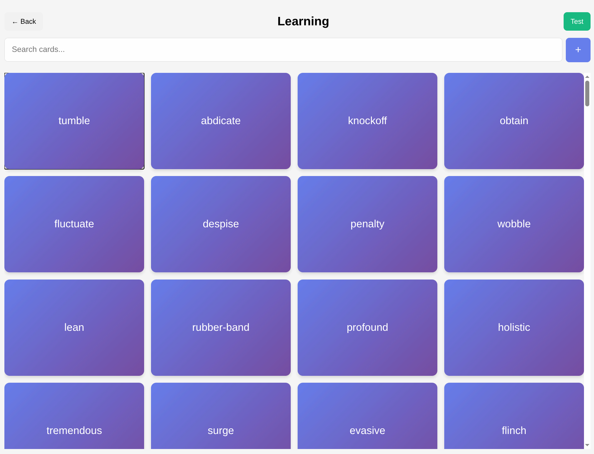
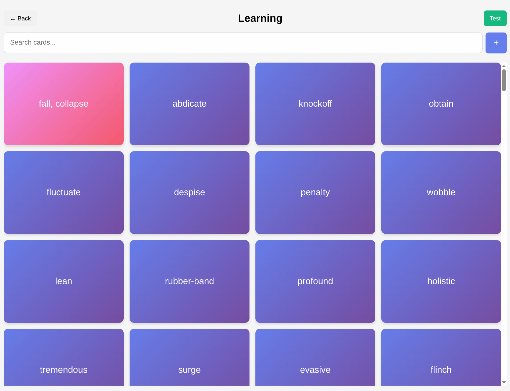

# Flip to Learn

A flashcard app for learning anything you want. Create cards with questions and answers, organize them into categories, and study by flipping through them.

## Screenshots





## Getting Started

```bash
bun install
bun run dev
```

## Building

```bash
bun run build
```

## Deploy

```bash
bun run deploy
```